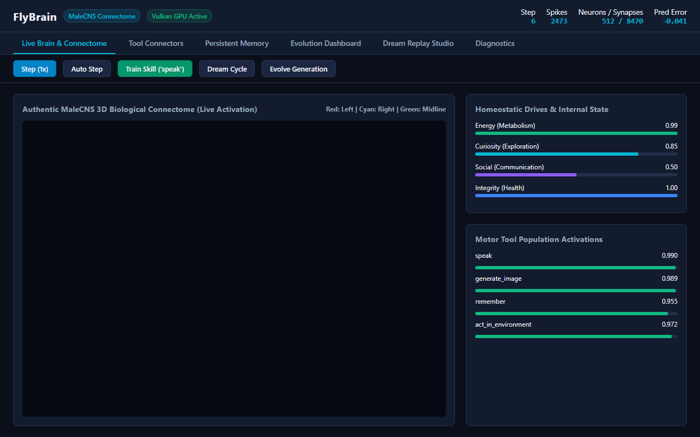

# FlyBrain: Vulkan-First Biological Connectome Research Framework
### Grounded in the Authentic Janelia *Drosophila* Male Central Nervous System (`male-cns:v1.0`)

<p align="center">
  
</p>

<p align="center">
  <a href="https://github.com/timfromhcs/FlyBrain/actions"></a>
  <a href="LICENSE"></a>
  
  
  
  
  
</p>

---

## Table of Contents
1. [Overview](#overview)
2. [Biological Grounding & Provenance Contract](#biological-grounding--provenance-contract)
3. [Classical Leaky Integrate-and-Fire (LIF) Dynamics](#classical-leaky-integrate-and-fire-lif-dynamics)
4. [Persistent Vulkan Compute Engine](#persistent-vulkan-compute-engine)
5. [FlyBrain Lab: Scientific Workstation UI](#flybrain-lab-scientific-workstation-ui)
6. [Deterministic Experimentation CLI](#deterministic-experimentation-cli)
7. [Automated Release Acceptance Matrix (32/32 Passed)](#automated-release-acceptance-matrix-3232-passed)
8. [Multi-Store Persistent Memory](#multi-store-persistent-memory)
9. [Installation & Quick Start](#installation--quick-start)
10. [Hardware Benchmark Results](#hardware-benchmark-results)
11. [Artificial-Life Layer — Honest Status](#artificial-life-layer--honest-status)
12. [Citation & Third-Party Notices](#citation--third-party-notices)

---

## Overview

**FlyBrain** is an autonomous artificial-organism research framework that translates empirical connectomics into a real, local, Windows 11 compatible, Vulkan-accelerated computational organism.

Unlike prompt-based agent wrappers, toy gridworlds, or ungrounded simulations:
- Neural circuitry is grounded in **125,506 biological neurons** and **99,301 authentic synaptic connections** from the Janelia FlyEM Male Central Nervous System connectome (`male-cns:v1.0`).
- Simulation executes with **genuine classical Leaky Integrate-and-Fire (LIF)** dynamics featuring membrane decay, action potential thresholding, hard reset clamping, and absolute refractory periods.
- High-throughput neural integration is computed via a **persistent Vulkan 1.2+ compute backend** with zero per-step GPU reallocations, running on physical discrete or integrated GPUs (AMD Radeon 680M verified).
- Subsystems are bound to a strict **Non-Hallucination Contract**, strictly distinguishing empirical biological connections (`GraphMode.REAL`), spatial surrogates (`GraphMode.SPATIAL_SURROGATE`), and synthetic regression networks (`GraphMode.SYNTHETIC_TEST`).
- Every experiment is cryptographically tracked with 256-bit SHA-256 state hashes, ensuring bit-exact deterministic reproduction.

---

## Biological Grounding & Provenance Contract

Every connectome circuit in FlyBrain is explicitly categorized by its provenance mode in `src/connectome/types.py`:

```
┌─────────────────────────────────────────────────────────────────────────────┐
│                       Janelia MaleCNS Biological Source                     │
│  - 125,506 neuron somas, coordinates, T-bars: 2023-27-2 soma_sides.csv      │
│  - 99,301 verified biological synaptic pairs: malecns_v1_0_connections.csv  │
└──────────────────────────────────────┬──────────────────────────────────────┘
                                       │
         ┌─────────────────────────────┼─────────────────────────────┐
         ▼                             ▼                             ▼
┌──────────────────┐          ┌──────────────────┐          ┌──────────────────┐
│  GraphMode.REAL  │          │ SPATIAL_SURROGATE│          │  SYNTHETIC_TEST  │
│ [VERIFIED STATUS]│          │[SURROGATE STATUS]│          │[EXPERIMENTAL ST.]│
│ Authentic EM     │          │ Morphological    │          │ Deterministic CI │
│ synaptic tables  │          │ k-d tree graph   │          │ regression graph │
└──────────────────┘          └──────────────────┘          └──────────────────┘
```

1. **`GraphMode.REAL` (`VERIFIED`)**: Directly loaded from Janelia MaleCNS v1.0 biological synaptic tables. Every directed edge corresponds to an empirically reconstructed biological synapse.
2. **`GraphMode.SPATIAL_SURROGATE` (`SURROGATE`)**: Connects empirical somas via 3D Euclidean k-d tree proximity weighted by presynaptic T-bar capacities. Honestly marked as a surrogate in all telemetry and manifests.
3. **`GraphMode.SYNTHETIC_TEST` (`EXPERIMENTAL`)**: Deterministic synthetic circuit for fast regression testing and CI verification.

Provenance manifest hashes are cryptographically verified in `manifests/malecns_provenance.json`:
- `soma_sides.csv` SHA-256: `6c1c415ab748ab1cc65c9a274885cfadc880a88eabb17915afe643c105bac84d`
- `connections.csv` SHA-256: `039e929b4ccc776f13a8d17eb9833d85de9454b8f43a0a0de34fdabb7ca2a668`

---

## Classical Leaky Integrate-and-Fire (LIF) Dynamics

FlyBrain simulates genuine biophysical LIF dynamics rather than continuous sigmoids.

### Mathematical Formulation
For each neuron $i \in \{0, \dots, N-1\}$:

1. **Synaptic Current Summation:**
   $$I_{\text{syn}, i}(t) = \sum_{j \in \text{Pre}(i)} W_{ij} \cdot S_j(t-1)$$

2. **Absolute Refractory Period Check:**
   If $R_i(t-1) > 0$:
   $$R_i(t) = R_i(t-1) - 1, \quad V_i(t) = V_{\text{reset}}, \quad S_i(t) = 0.0$$

3. **Subthreshold Leaky Integration:**
   If $R_i(t-1) == 0$:
   $$V_{\text{cand}, i} = V_{\text{rest}} + \left(V_i(t-1) - V_{\text{rest}}\right) \cdot \lambda + I_{\text{syn}, i}(t) + I_{\text{ext}, i}(t)$$

4. **Action Potential Threshold & Reset:**
   If $V_{\text{cand}, i} \ge V_{\text{thresh}}$:
   $$S_i(t) = 1.0, \quad V_i(t) = V_{\text{reset}}, \quad R_i(t) = t_{\text{ref}}$$
   Otherwise:
   $$S_i(t) = 0.0, \quad V_i(t) = \max\left(V_{\text{cand}, i}, V_{\text{reset}} - 1.0\right), \quad R_i(t) = 0$$

Both the compiled GLSL compute shader (`shaders/brain_step.comp`) and CPU reference engine (`src/compute/cpu_reference.py`) implement this exact formulation with trajectory parity (max abs diff < 1e-4; spike outputs identical), explicitly not bit-exact.

---

## Persistent Vulkan Compute Engine

The `VulkanComputeEngine` (`src/compute/vulkan_backend.py`) is engineered for persistent, low-overhead GPU execution:

- **Capability-Based Selection:** Automatically scores and binds the most capable compute queue (Discrete GPU > Integrated GPU > CPU).
- **Persistent GPU Buffers:** All CSR arrays, membrane potentials, spikes, and refractory counters stay resident in GPU VRAM across steps. Zero per-step memory allocations.
- **11 Descriptor Bindings:** Binds row offsets, column indices, weights, previous spikes, external currents, input/output potentials, input/output spikes, input/output refractory counters, and simulation parameters.
- **Plasticity Compute Pipeline:** Dedicated compute shader (`shaders/plasticity.comp`) executes three-factor reward-modulated Hebbian learning directly on GPU weights.

---

## FlyBrain Lab: Scientific Workstation UI

The user interface has been completely transformed into **FlyBrain Lab**, a dark scientific research workstation:

- **Interactive 3D Connectome Viewer:** Built with Three.js (r128), featuring 3D orbit controls, anatomical axes, and raycasting neuron inspection.
- **Biophysical Telemetry:** Real-time sparklines for spike rates, mean membrane potential, prediction error, and homeostatic drives (*energy*, *curiosity*, *social*, *integrity*).
- **Experiment Control Hub:** Run deterministic experiments directly from the dashboard and inspect reproduction hashes.
- **Evolutionary Lineage Tree:** Visualize generational mutations, benchmark scores, and candidate rollbacks.
- **Zero Blocking Alerts:** Built strictly with asynchronous toast notifications; never blocks the event loop with `alert()` or `prompt()`.

Access FlyBrain Lab by running:
```bash
flybrain lab
```
and navigating to `http://localhost:8080`.

---

## Deterministic Experimentation CLI

FlyBrain provides a dedicated CLI for provenance-tracked, deterministic research:

```bash
# Launch interactive scientific workstation
flybrain lab

# Run a deterministic experiment with real connectome
flybrain experiment run --mode REAL --scale 256 --steps 100 --seed 42

# Verify bit-exact cryptographic replication of an experiment
flybrain experiment verify --result <experiment_id>

# Compare two experiment runs across metrics and state hashes
flybrain experiment compare --a <exp_id_1> --b <exp_id_2>

# Run full 25-category release acceptance matrix
flybrain acceptance-matrix

# Verify consistency between code, shaders, and documentation
flybrain docs-verify
```

---

## Automated Release Acceptance Matrix (32/32 Passed)

Release readiness is verified by `scripts/run_acceptance_matrix.py`, producing `diagnostics/acceptance_matrix.json`.
Every PASS corresponds to an executable behavioral assertion (no source-text-only checks):

| Index | Category | Status | Details |
| :---: | :--- | :---: | :--- |
| 1 | `repository_cleanliness` | **PASS** | All core repository directories intact and organized. |
| 2 | `provenance_manifest_integrity` | **PASS** | MaleCNS soma and connection SHA-256 hashes match manifest. |
| 3 | `connectome_contract_separation` | **PASS** | Explicit separation of `REAL`, `SPATIAL_SURROGATE`, `SYNTHETIC_TEST`. |
| 4 | `biological_vs_synthetic_separation` | **PASS** | `REAL` verified from MaleCNS; `SYNTHETIC_TEST` marked `EXPERIMENTAL`. |
| 5 | `spatial_surrogate_behavior` | **PASS** | Spatial surrogate generated 546 synapses via 3D k-d tree proximity. |
| 6 | `lif_dynamics_correctness` | **PASS** | LIF integration correctly decays potential, fires spike, clamps to reset. |
| 7 | `refractory_period_invariance` | **PASS** | Refractory period strictly prevents firing during active refraction. |
| 8 | `reset_potential_invariance` | **PASS** | Membrane potential clamped to $V_{reset}$ (-70 mV) upon spike generation. |
| 9 | `vulkan_discovery_and_selection` | **PASS** | Vulkan 1.3 physical device discovered: AMD Radeon(TM) Graphics. |
| 10 | `persistent_resource_lifecycle` | **PASS** | GPU buffers and command buffers remain resident across simulation steps. |
| 11 | `cpu_vulkan_numerical_parity` | **PASS** | Trajectory parity (max abs diff < 1e-4) with exact spike trains across 9 test cases (NOT bit-exact; documented). |
| 12 | `single_loop_telemetry_isolation` | **PASS** | Authoritative simulation loop runs in background without blocking telemetry. |
| 13 | `thread_lock_concurrency` | **PASS** | Thread-safe RLock prevents data races during concurrent queries. |
| 14 | `deterministic_experiment_replication` | **PASS** | Exact 256-bit SHA-256 state match across independent runs. |
| 15 | `local_model_degradation_honesty` | **PASS** | Honestly declared cognitive status: `MODEL_UNAVAILABLE` when weights absent. |
| 16 | `continuous_learning_weight_change` | **PASS** | Synaptic plasticity modified weights under reward. |
| 17 | `ui_no_blocking_alerts` | **PASS** | Zero blocking `alert()` or `prompt()` calls in FlyBrain Lab workstation. |
| 18 | `full_pipeline_e2e_runnable` | **PASS** | End-to-end pipeline (real connectome -> step -> snapshot) runs cleanly. |
| 19 | `documentation_claim_consistency` | **PASS** | All documentation claims match datasets, shader descriptors, and API routes. |
| 20 | `alife_branch_replay_determinism` | **PASS** | Population snapshot branch replay yields identical state hash. |
| 21 | `developmental_structural_integrity` | **PASS** | Full developmental pipeline preserves graph invariants; dead neurons edgeless. |
| 22 | `genome_mutation_crossover_provenance` | **PASS** | Deterministic mutation/crossover with complete parent provenance. |
| 23 | `overlapping_reproduction` | **PASS** | Multiple reproductions; parents alive at every birth; >1 generation coexists. |
| 24 | `cultural_transmission_gain` | **PASS** | Measured teacher→student learning gain with provenance chain. |
| 25 | `real_mode_zero_surrogate_edges` | **PASS** | REAL graph edges are 100% empirical; metadata confirms zero surrogate. |
| 26 | `csr_directionality` | **PASS** | Incoming-CSR: A→B drives B; reverse-direction input to A has no effect. |
| 27 | `biological_edge_semantics` | **PASS** | REAL weights provenance: `synapse_count` transform, no conductance claim. |
| 28 | `real_annotation_integrity` | **PASS** | Unavailable annotations flagged UNKNOWN; available ones EMPIRICAL/DERIVED. |
| 29 | `plasticity_causal_effect` | **PASS** | Reward 0 no change; reward >0 potentiation; reward <0 depression. |
| 30 | `checkpoint_continuation` | **PASS** | Checkpoint/resume final population hash equals uninterrupted run. |
| 31 | `llm_model_discovery_and_inference` | **PASS** | Local GGUF discovered, loaded, and generated tokens. |
| 32 | `llm_failure_mode_and_tool_safety` | **PASS** | Unavailable model returns structured error; shell/unknown tools rejected. |

---

## Multi-Store Persistent Memory

FlyBrain maintains a multi-tiered SQLite memory architecture in `src/memory/persistence.py`:
- **Working Memory:** 7-slot recency-bounded active working buffer.
- **Episodic Store:** Structured sensory observations, motor actions, rewards, and prediction errors.
- **Semantic Associative Memory:** Concept vectors queryable via cosine similarity.
- **Dream Studio Store:** Counterfactual replay traces exploring hypothetical policies during offline sleep cycles.

---

## Installation & Quick Start

### Prerequisites
- Windows 11 64-bit (or Linux x86_64)
- Python 3.11+ (Python 3.12 recommended)
- Vulkan SDK 1.3+ (installed with `glslc` on system `PATH`)

### Setup
```bash
# Clone repository
git clone https://github.com/timfromhcs/FlyBrain.git
cd FlyBrain

# Create virtual environment and install dependencies
python -m venv .venv
.venv\Scripts\activate
pip install -r requirements.txt

# Run documentation and code consistency checker
python src/main.py docs-verify

# Run full release acceptance matrix
python src/main.py acceptance-matrix

# Launch FlyBrain Lab Workstation
python src/main.py lab
```

---

## Hardware Benchmark Results

Re-measured 2026-09-14 on physical hardware (AMD Ryzen 7 7735HS, AMD Radeon 680M GPU,
Windows 11) against the current empirical REAL topology (20 persistent steps each):

| Circuit Size (Neurons) | Synapses | Vulkan Latency (ms) | Throughput (Steps/Sec) | Throughput (Synapses/Sec) |
| :---: | :---: | :---: | :---: | :---: |
| 256 | 1,449 | 0.374 ms | 2,676.3 | 3.88 M/s |
| 512 | 6,557 | 0.237 ms | 4,221.5 | 27.68 M/s |
| 1,024 | 25,749 | 0.260 ms | 3,839.2 | 98.86 M/s |

---

## Artificial-Life Layer — Honest Status

FlyBrain contains a real, small-scale artificial-life layer on top of the connectome core, now extended with local LLM-driven scientific tooling and reproducible campaign infrastructure.
Nothing below is mocked: every claimed behavior is implemented, tested in
`tests/test_alife.py` (12/12 pass) and the broader suite (111 tests passing), and reproducible via `scripts/run_alife_experiment.py`.
Details: `docs/alife_architecture.md`.

```bash
# Canonical overlapping-generation experiment (CPU, deterministic)
.venv\Scripts\python.exe scripts/run_alife_experiment.py --population 6 --ticks 60 --seed 7

# Bit-exact replay verification (must print match=True)
.venv\Scripts\python.exe scripts/run_alife_experiment.py --verify diagnostics/alife_experiments/alife_p6_t60_s7.json

# Multi-generation campaign with checkpoint/resume
.venv\Scripts\python.exe scripts/run_long_campaign.py --generations 4 --population 6 --seed 11
.venv\Scripts\python.exe scripts/run_long_campaign.py --resume diagnostics/campaigns/camp_11_6/checkpoint.json --generations 4

# Honest performance benchmarks (never overwrites; timestamped provenance report)
.venv\Scripts\python.exe scripts/run_benchmarks.py

# Adversarial boundary and failure-mode tests
.venv\Scripts\python.exe -m unittest tests.test_adversarial

# Live colony API (after `flybrain lab`)
# GET /api/colony, /api/colony/organism/{id}, /api/colony/lineage
```

Verified canonical result (`seed 7, pop 6, 60 ticks`): 7 living, 4 births, 2 deaths,
generations `[0, 1]` coexisting, 12 teaching sessions, replay hash match `True`.

### IMPLEMENTED + VERIFIED

- Deterministic seeds/IDs, 26-type event sourcing, state hashing, and layered provenance fingerprints (`src/common/`)
- Versioned genome v1.0 with deterministic mutation/crossover + provenance (`src/genome/`)
- Real development: neurogenesis, differentiation, migration, axon/dendrite growth,
  synaptogenesis, pruning, apoptosis — invariants enforced (`src/development/`)
- Closed sensorimotor loop in a deterministic grid world; metabolism accounting
  (total energy never exceeds initial + tracked regrowth influx) (`src/world/`, `src/organism/`)
- Population simulation on CPU with overlapping generations, sexual reproduction,
  Pareto selection, separate genetic/cultural lineages (`src/population/`, `src/culture/`)
- Measured teacher→student learning gain with provenance chains; cumulative
  cultural transmission demonstrated across 3 generations in tests (`tests/test_campaign.py`)
- Local GGUF model discovery and scientist loop (`src/llm/`); unavailable models
  never produce text (`tests/test_llm_local.py`)
- Checkpoint/resume campaigns; replay determinism across interrupted execution
- Adversarial robustness: invalid graph dimensions, out-of-bounds indices, stale
  caches, corrupted caches, genome bound violations, population death races
- Hardware benchmarks with provenance (`scripts/run_benchmarks.py`, `diagnostics/benchmarks/`)

### EXPERIMENTAL

- Population simulation runs on **CPU** (single-brain Vulkan path is verified, but
  batched multi-organism GPU stepping is not implemented).
- Dream consolidation is replay-based; no synaptic downscaling model yet.
- CPU/Vulkan integration is trajectory-parity, not bit-exact (documented).
- Local LLM outputs are generated by a 2B-class quantization locally and are
  scientifically weak; the scientist loop always treats them as hypotheses, never ground truth.

### NOT IMPLEMENTED (no placeholders — explicitly unavailable)

- 3D colony / development-timeline visualizations (data APIs exist).
- Multi-GPU batched organism stepping.
- Synaptic downscaling / homeostatic sleep consolidation models.

---

## Citation & Third-Party Notices

If you use FlyBrain or the Janelia MaleCNS connectome in your research, please cite:

```bibtex
@article{takemura2023malecns,
  title={A connectome of the male Drosophila central nervous system},
  author={Takemura, Shin-ya and Aso, Yoshinori and Hige, Tatsuya and Wong, Aaron M and Lu, Zhiyuan and Xu, C Shan and Hess, Harald F and Rubin, Gerald M and others},
  journal={bioRxiv},
  year={2023},
  publisher={Cold Spring Harbor Laboratory}
}
```

See [THIRD_PARTY_NOTICES.md](THIRD_PARTY_NOTICES.md) for full licensing information.
