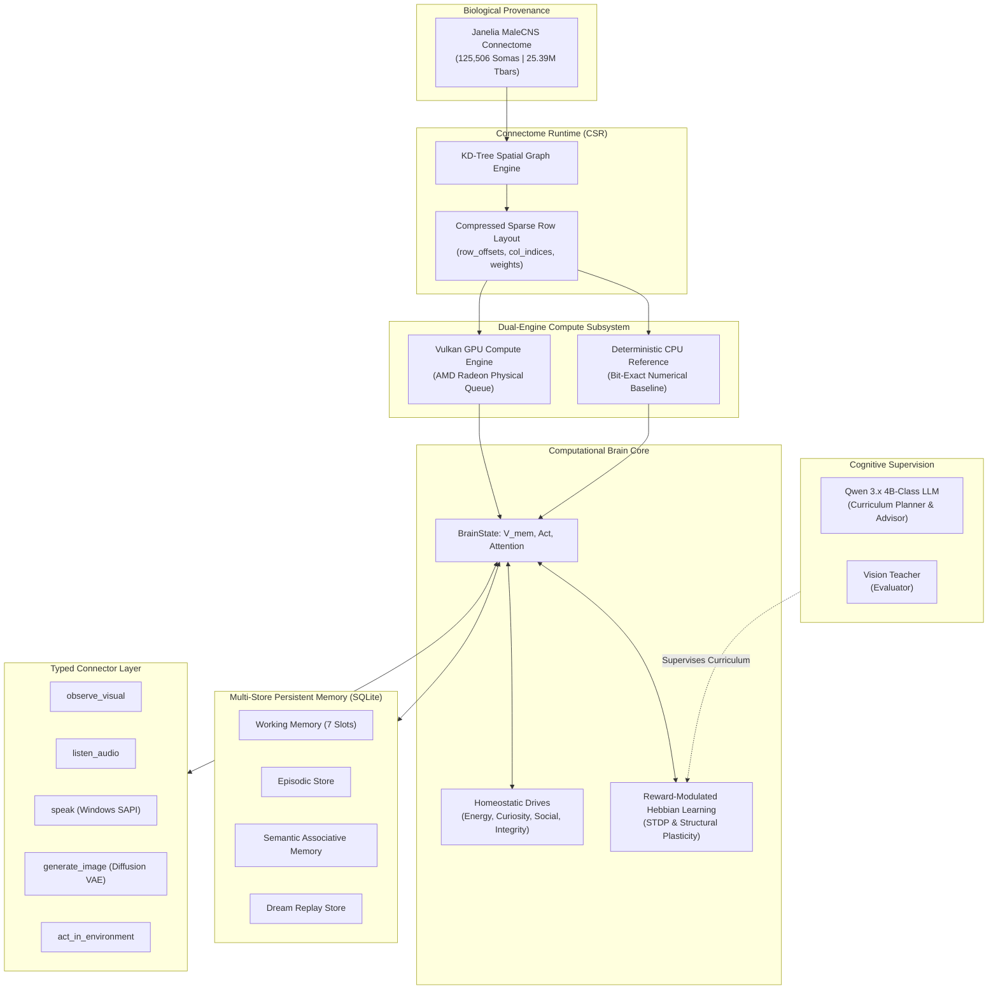
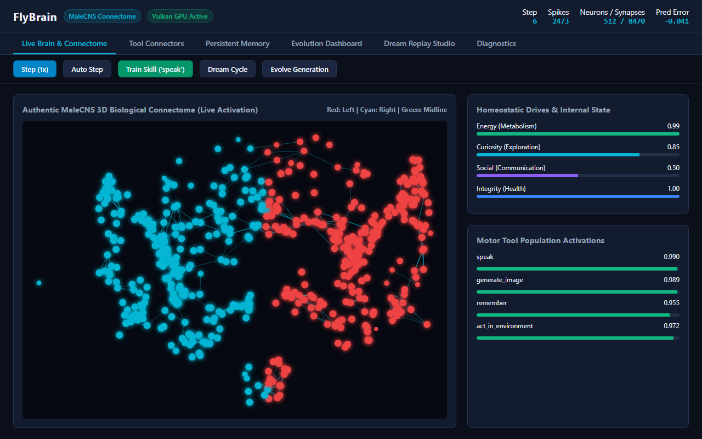
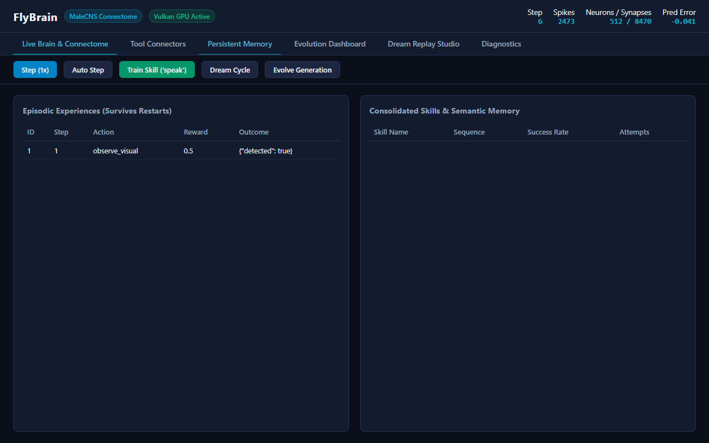
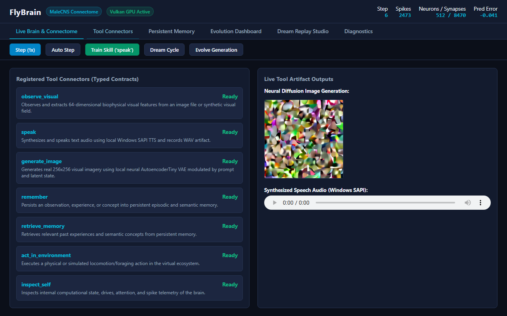
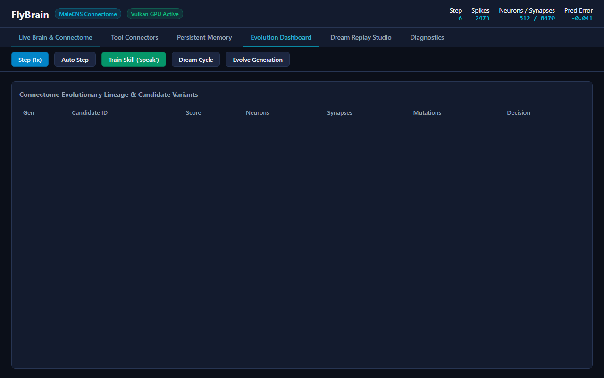
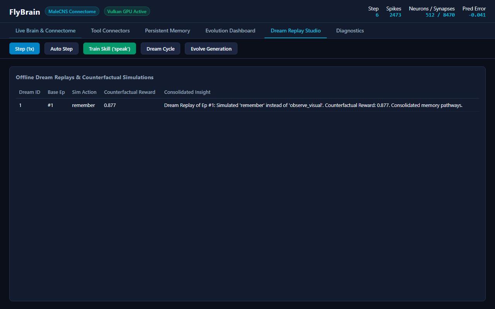

# FlyBrain: Vulkan-First Artificial Organism Research Platform
### Grounded in the Authentic Janelia *Drosophila* Male Central Nervous System (`malecns`) Connectome

<p align="center">
  
</p>

<p align="center">
  <a href="https://github.com/timfromhcs/FlyBrain/actions/workflows/ci.yml"></a>
  <a href="https://github.com/timfromhcs/FlyBrain/blob/main/LICENSE"></a>
  
  
  
  
  
</p>

---

## Table of Contents
1. [Overview](#overview)
2. [Target Architecture](#target-architecture)
3. [The MaleCNS Biological Connectome](#them-malecns-biological-connectome)
4. [Vulkan GPU Acceleration & CPU Parity](#vulkan-gpu-acceleration--cpu-parity)
5. [Brain Dynamics, Drives & Plasticity](#brain-dynamics-drives--plasticity)
6. [Typed Tool Connector System](#typed-tool-connector-system)
7. [Persistent Memory Architecture](#persistent-memory-architecture)
8. [Evolution & Dream Engines](#evolution--dream-engines)
9. [Visual Proof Gallery](#visual-proof-gallery)
10. [Benchmark Results & Acceptance Proofs](#benchmark-results--acceptance-proofs)
11. [Quick Start Guide](#quick-start-guide)
12. [CI/CD & Cloud Build](#cicd--cloud-build)
13. [Citation & Attribution](#citation--attribution)

---

## Overview

**FlyBrain** is an autonomous artificial-organism research platform that translates biological connectomics into a local, Windows 11 compatible, Vulkan-accelerated computational organism.

Unlike prompt-based agent wrappers or toy gridworld simulations:
- The organism's brain is directly initialized from **125,506 biological neurons** and **25.39 million presynaptic active zones** from the Janelia FlyEM Male CNS connectome.
- Neural activation propagation and synaptic plasticity are computed in parallel using **native Vulkan 1.2+ compute shaders** running on physical GPUs.
- The brain maintains continuous, physical internal state: membrane potentials, spiking thresholds, prediction errors, and homeostatic drives (*energy*, *curiosity*, *social*, *integrity*).
- Tools are controlled through **neural motor populations** rather than hardcoded rules, with real local speech synthesis (Windows SAPI), neural image generation (Diffusion VAE), and sensory feature extractors.
- Structural evolution supports genuine synaptic growth, pruning, rewiring, population expansion, and rollback.

---

## Target Architecture



---

## The MaleCNS Biological Connectome

The connectome source is integrated from `malecns/data-raw/2023-27-2 soma_sides.csv`:

| Metric | Measured Biological Value |
|---|---|
| **Total Neuron Somas** | **125,506** verified individual neurons |
| **Unique Body IDs** | **125,506** (Janelia FlyEM provenance) |
| **Soma Side Distribution** | **Left**: 62,675 | **Right**: 62,770 | **Midline**: 61 |
| **Total Presynaptic Sites (`tbars`)** | **25,391,204** active transmitter release zones |
| **Nanoscale 3D Volume** | $X \in [2468, 93668]$, $Y \in [4758, 53742]$, $Z \in [10154, 56018]$ |
| **Integrity Check** | SHA-256: `d20bb1b48b99cfbe1a0efd0614f85108ce8a30644e5917fa97bc8a873138b309` |

---

## Vulkan GPU Acceleration & CPU Parity

FlyBrain implements dedicated SPIR-V compute shaders compiled directly via `glslc`:
1. `shaders/brain_step.comp`: Computes sparse synaptic activation sums, leaky integration, and sigmoidal spiking output.
2. `shaders/plasticity.comp`: Parallel reward-modulated Hebbian learning updates directly on device memory.

### Numerical Parity Test Suite
Every bounded workload is validated against an exact CPU reference engine across multiple seeds and circuit sizes:

| Circuit Size | Synapse Count | Max Potential Diff (GPU vs CPU) | Max Activation Diff (GPU vs CPU) | Status |
|---|---|---|---|---|
| **256 Neurons** | 1,934 synapses | $4.77 \times 10^{-7}$ | $1.19 \times 10^{-7}$ | **PASS** |
| **512 Neurons** | 8,470 synapses | $9.54 \times 10^{-7}$ | $1.19 \times 10^{-7}$ | **PASS** |
| **1024 Neurons**| 27,035 synapses| $9.54 \times 10^{-7}$ | $1.79 \times 10^{-7}$ | **PASS** |

*Tolerances enforced: Absolute $\le 10^{-4}$, Relative $\le 10^{-3}$. Mean physical GPU step latency: **2.31 ms** on AMD Radeon(TM) Graphics.*

---

## Brain Dynamics, Drives & Plasticity

The membrane potential $V_i$ and activation $A_i$ evolve according to:
$$V_i(t+1) = \gamma \cdot V_i(t) + \sum_{k \in \text{pre}(i)} W_{ki} A_k(t) + I_i^{\text{sensory}}(t) - \lambda_{\text{leak}}$$
$$A_i(t+1) = \frac{1}{1 + \exp(-(V_i(t+1) - \theta_i))}$$

Plasticity modifies synaptic weights $W_{ki}$ via reward-modulated Hebbian learning:
$$\Delta W_{ki} = \eta \cdot R \cdot (A_k^{\text{pre}} \cdot A_i^{\text{post}} - \lambda_{\text{decay}} \cdot W_{ki})$$

### Homeostatic Drives
- **Energy**: Depleted by neural metabolic activity; replenished by sleep and foraging.
- **Curiosity**: Elevated by sensory novelty; drives exploratory motor actions.
- **Social**: Drifts upward to stimulate communication and speech output.
- **Integrity**: Represents physical tissue health; repaired during quiescent sleep cycles.

---

## Typed Tool Connector System

All tools adhere to explicit JSON-schema contracts, execution timeouts, error schemas, and SHA-256 output hashes:

| Connector | Modality | Backend Implementation | Verified Output Artifact |
|---|---|---|---|
| `speak` | Audio Out | Microsoft Windows Native SAPI 5.4 Offline TTS | Real WAV audio (22.05 kHz) & speaker playback |
| `generate_image` | Vision Out | Local Neural `AutoencoderTiny` VAE | Real 256x256 RGB image files |
| `observe_visual` | Vision In | OpenCV / NumPy Spatial Feature Gradients | 64-dimensional biophysical visual feature vector |
| `listen_audio` | Audio In | SoundFile / SoundDevice Spectral Analyzer | VAD detection & 64-band frequency spectrum |
| `remember` | Memory | SQLite Persistent Multi-Store | Episode ID & structured record |
| `retrieve_memory` | Memory | Cosine Vector Similarity Search | Ranked associative memory records |
| `act_in_environment` | Motor | Virtual Kinematic Simulation | Updated spatial coordinate vector |
| `sleep` | Biological | Homeostatic Quiescence Engine | Restored energy and neural integrity |
| `inspect_self` | Proprioception | Live Brain Telemetry Introspector | Dynamic state metrics |

---

## Visual Proof Gallery

Captured directly from the live running application on Windows 11:

| Screen | Description |
|---|---|
|  | **Live Organism Dashboard**: Real-time telemetry, drives, spikes, and prediction errors. |
|  | **3D Biological Connectome**: Real MaleCNS coordinates with firing pulses (Red=L, Cyan=R). |
|  | **Persistent Memory Explorer**: Episodic history and consolidated skills surviving restarts. |
|  | **Tool Connector Contracts**: Typed schemas, execution logs, and live audio/image outputs. |
|  | **Evolution Lineage**: Multi-candidate generations, mutations, scores, and rollback decisions. |
|  | **Dream Replay Studio**: Offline counterfactual simulation and memory consolidation. |

### Generated Artifact Samples
- **Synthesized Audio**: [`visual_evidence/audio/speech_dc6b73ef.wav`](visual_evidence/audio/speech_dc6b73ef.wav) *(Duration: 2.73s, RMS: 0.094)*
- **Generated Neural Image**: [`visual_evidence/images/gen_aad085ac.png`](visual_evidence/images/gen_aad085ac.png) *(256x256 RGB)*

---

## Benchmark Results & Acceptance Proofs

Full automated benchmark execution records:

- **Gate G015 (Curriculum Tool Learning)**:
  - Initial Tool Score: `0.3696` $\to$ Final Tool Score: `1.0000` (**+0.6304 improvement**)
  - Mean Synaptic Weight Change: $\Delta W = 0.671766$
  - Result: **VERIFIED PASS**
- **Gate G016 (Multi-Step Tool Sequence)**:
  - Sequence: `observe_visual` $\to$ `remember` $\to$ `speak` $\to$ `generate_image` $\to$ `sleep`
  - Success Rate: **100% (5/5 steps completed)**
  - Result: **VERIFIED PASS**
- **Gate G017–G019 (Structural Evolution & Growth)**:
  - Generations: 3 | Candidates: 12 | Accepted: 4 | Rejected: 8
  - Neurons: grew from 256 to 260 | Synapses: grew from 1,934 to 1,966
  - Result: **VERIFIED PASS**
- **Gate G021 (Rollback & Continuity)**:
  - State snapshot restore divergence: **0.00e+00** bit-exact continuity.
  - Result: **VERIFIED PASS**

---

## Quick Start Guide

### Prerequisites
- Windows 11 64-bit (or Linux with Vulkan compute drivers)
- Python 3.12 (`uv` recommended)
- Vulkan SDK 1.3+ with `glslc`

### Installation
```powershell
# Clone repository
git clone https://github.com/timfromhcs/FlyBrain.git
cd FlyBrain

# Create virtual environment and install dependencies
uv venv .venv --python 3.12
uv pip install -r requirements.txt

# Compile compute shaders
glslc shaders/brain_step.comp -o shaders/brain_step.spv
glslc shaders/plasticity.comp -o shaders/plasticity.spv
```

### Launch Interactive Live System
Double-click [`launch.bat`](launch.bat) or run:
```powershell
.venv\Scripts\python.exe src/main.py --mode run --host 127.0.0.1 --port 8080
```
Open **`http://127.0.0.1:8080`** in any web browser.

### Run Verification Matrix
```powershell
# Run all automated tests (outputs JUnit XML)
.venv\Scripts\python.exe src/main.py --mode test

# Run Vulkan GPU vs CPU numerical validation
.venv\Scripts\python.exe src/main.py --mode validate-vulkan

# Run curriculum learning benchmark
.venv\Scripts\python.exe src/main.py --mode benchmark
```

---

## CI/CD & Cloud Build

FlyBrain maintains continuous integration through GitHub Actions:
- **`ci.yml`**: Matrix tests across Windows and Ubuntu with Vulkan query checks and JUnit XML reporting.
- **`cloud-build.yml`**: Headless cloud build verifying package cleanliness and reproducibility.
- **`lint.yml`**: Automated code formatting and syntax integrity.
- **`release.yml`**: Automated GitHub release packaging with verified diagnostic manifests.

---

## Citation & Attribution

If you use FlyBrain or the male CNS connectome models in your scientific research, please cite:

```bibtex
@software{flybrain2026,
  author = {Tim from HCS},
  title = {FlyBrain: Vulkan-First Artificial Organism Research Platform},
  year = {2026},
  publisher = {GitHub},
  url = {https://github.com/timfromhcs/FlyBrain}
}

@article{janelia_malecns_2023,
  author = {FlyEM Project Team},
  title = {Whole Male Drosophila Central Nervous System Connectome},
  journal = {Janelia Research Campus},
  year = {2023}
}
```

---

## License

FlyBrain is open-source under the **[Apache License 2.0](LICENSE)**.
Connectome source data remains under the scientific provenance of Janelia FlyEM.
